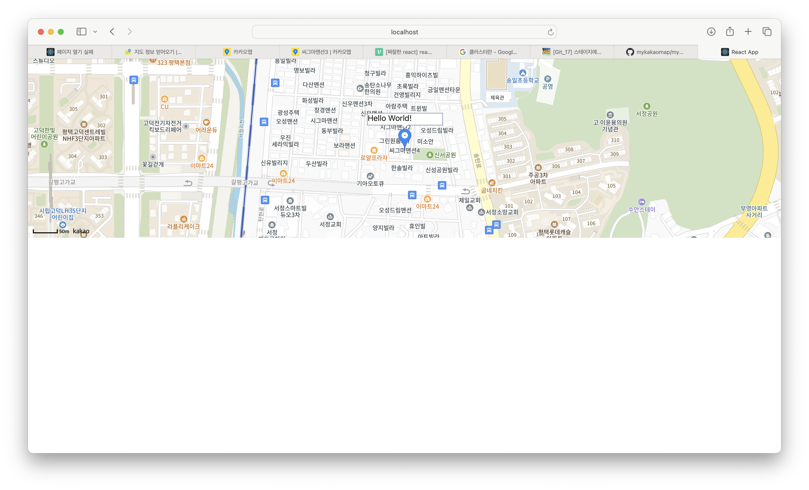
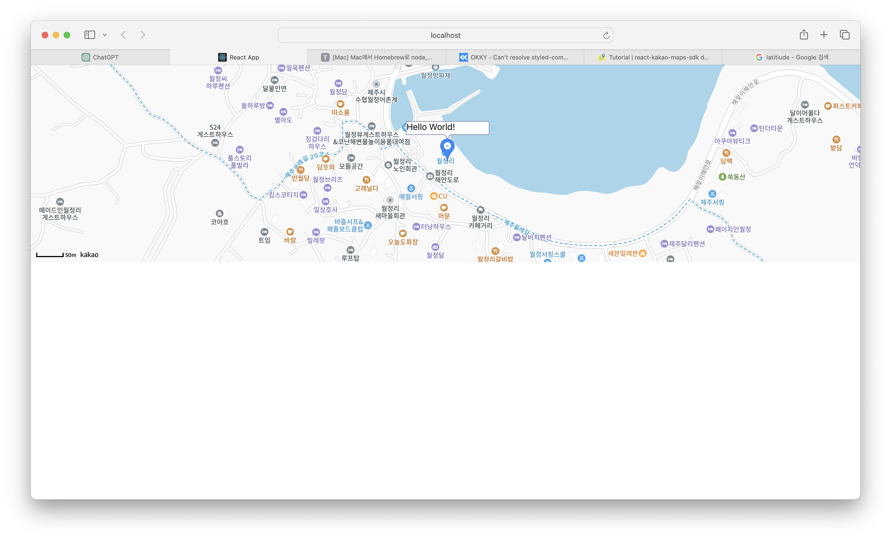
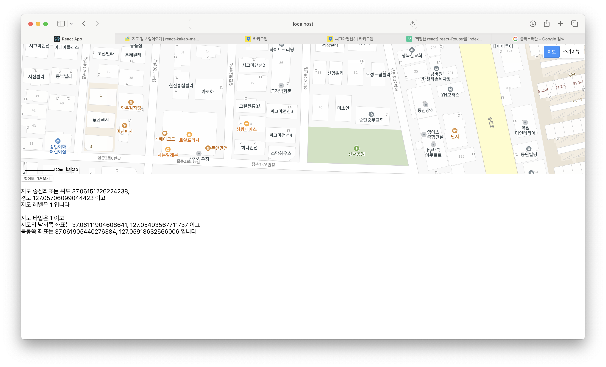

### yarn 설치안될 때

```terminal
brew install yarn --ignore-dependencies
```

물론 homebrew가 정상적으로 설치되어 있어야함

### styled-components임;;

### git 명령어
https://wishlan.tistory.com/entry/Git17-스테이지에-등록한올린-파일을-취소삭제하기내리기
https://velog.io/@delilah/GitHub-Git-명령어-모음

### zsh theme
https://github.com/romkatv/powerlevel10k


# 6.22 react-kakao-maps-sdk

```terminal
npm install react-kakao-maps-sdk
# or
yarn add react-kakao-maps-sdk
```


## `map` 띄우기
```javascript
import React from 'react';
import {Map, MapMarker} from 'react-kakao-maps-sdk';

const App = () => {
  return (
    <Map
      center={{ lat: 33.5563, lng: 126.79581 }}
      style={{ width: "100%", height: "360px" }}
    >
    </Map>
  )
};

export default App;
```

### Map 컴포넌트 `center`에 객체를 전달해준다.
```javascript
{
  lat : 위도,
  lng : 경도,
}
```


  
## 특정 좌표에 `marker` 붙이기

```javascript
import React from 'react';
import {Map, MapMarker} from 'react-kakao-maps-sdk';

const Map1 = () => {
   return(
      <Map
      center={{ lat: 37.0614, lng: 127.0569 }}
      style={{ width: "100%", height: "360px" }}
      >
      <MapMarker position={{ lat: 37.0614, lng: 127.0569 }}>
        <div style={{color:"#000"}}>Hello World!</div>
      </MapMarker>
    </Map>
   )
};

export default Map1;
```



### MapMarker Component에 position에 객체 받음
```javascript
{
  lat: '위도',
  lng: '경도',
}
```

### MapMarker컴포넌트 내에 감싸 특정 포지션에 원하는 요소를 추가할 수 있음

```javascript
<MapMarker position={{ lat: 33.55635, lng: 126.795841 }}>
  <div style={{color:"#000"}}>Hello World!</div>
</MapMarker>
```




## basic Map
```javascript
import React from 'react';
import { Map, useKakaoLoader } from 'react-kakao-maps-sdk';


const BasicMap = () => {
   useKakaoLoader();

   return (
      <Map // 지도를 표시할 Container
      id="map"
      center={{ lat: 37.0614, lng: 127.0569 }}
      style={{ width: "100%", height: "360px" }}
      level={3} // 지도의 확대 레벨
    />
   )
}

export default BasicMap;
```

위 코드를 보면 useKakaoLoader를 사용한다.
아마 맨 아래 바닐라 자바스크립트에서 구현시에 script를 불러올 때까지 기다리는 것을
useKakaoLoader가 대신 해주는 것 같다.

## move map

원하는 곳으로 부드럽게 이동하는 것이 가능하다.

```javascript
import { useState } from "react"
import { Map, useKakaoLoader } from "react-kakao-maps-sdk"


const MoveMap = () => {
  useKakaoLoader()

  const [state, setState] = useState({
    // 지도의 초기 위치
    center: { lat: 37.0614, lng: 127.0569 },
    // 지도 위치 변경시 panto를 이용할지에 대해서 정의
    isPanto: false,
  });
  

  return (
    <>
      <Map // 지도를 표시할 Container
        center={state.center}
        isPanto={state.isPanto}
        style={{
          // 지도의 크기
          width: "100%",
          height: "350px",
        }}
        level={3} // 지도의 확대 레벨
      ></Map>
      <p>
        <button
          onClick={() =>
            setState({
              center: { lat: 33.452613, lng: 126.570888 },
              isPanto: false,
            })
          }
        >
          지도 중심좌표 이동시키기
        </button>{" "}
        <button
          onClick={() =>
            setState({
              center: { lat: 33.45058, lng: 126.574942 },
              isPanto: true,
            })
          }
        >
          지도 중심좌표 부드럽게 이동시키기
        </button>

        <button
          onClick={() =>
            setState({
              center: { lat: 37.0614, lng: 127.0569 },
              isPanto: true,
            })
          }
        >
          원위치
        </button>
      </p>
    </>
  )
}

export default MoveMap;
```

방식은 간단하다 useState hook으로 center의 위도와 경도를 관리하고
버튼을 누를 때 state를 수정하는 식으로 부드러운 이동을 구현한다.

```javascript
const [state, setState] = useState({
  // 지도의 초기 위치
  center: { lat: 37.0614, lng: 127.0569 },
  // 지도 위치 변경시 panto를 이용할지에 대해서 정의
  isPanto: false,
});

...

<Map // 지도를 표시할 Container
  center={state.center}
  isPanto={state.isPanto}
  style={{
    // 지도의 크기
    width: "100%",
    height: "350px",
  }}
  level={3} // 지도의 확대 레벨
></Map>

...

<button
  onClick={() =>
    setState({
      center: { lat: 33.45058, lng: 126.574942 },
      isPanto: true,
    })
  }
>
  지도 중심좌표 부드럽게 이동시키기
</button>
```

## change level(줌인 줌아웃)


```javascript
import { useRef, useState } from "react"
import { Map, useKakaoLoader } from "react-kakao-maps-sdk"


const ChangeLevel = () => {
  useKakaoLoader()
  const mapRef = useRef(null)
  const defaultLevel = 3
  const [level, setLevel] = useState(defaultLevel)

  const handleLevel = (type) => {
    const map = mapRef.current
    if (!map) return

    if (type === "increase") {
      map.setLevel(map.getLevel() + 1)
      setLevel(map.getLevel())
    } else {
      // type === "decrease"
      map.setLevel(map.getLevel() - 1)
      setLevel(map.getLevel())
    }
  }

  return (
    <Map // 지도를 표시할 Container
      center={{
        lat: 33.450701,
        lng: 126.570667,
      }}
      style={{
        // 지도의 크기
        width: "100%",
        height: "350px",
      }}
      level={defaultLevel} // 지도의 확대 레벨
      zoomable={true}
      ref={mapRef}
    >
      <p>
        <button onClick={() => handleLevel("decrease")}>지도레벨 - 1</button>{" "}
        <button onClick={() => handleLevel("increase")}>지도레벨 + 1</button>{" "}
        <span id="maplevel">현재 지도 레벨은 {level} 레벨 입니다.</span>
      </p>
    </Map>
  )
}

export default ChangeLevel;
```

useRef를 이용하여 맵을 참조한다.
초기 스크립트가 다 불러와 졌을 때 초기값은 null이며 마운트가 되고
이후에 Map을 참조하게 된다. 


```javascript
center={{
  lat: 33.450701,
  lng: 126.570667,
}}
style={{
  // 지도의 크기
  width: "100%",
  height: "350px",
}}
level={defaultLevel} // 지도의 확대 레벨
zoomable={true}
ref={mapRef}
```

level이 상승할 수록 zoom out이 된다.
지도의 zoom 가능 여부는 zoomable 필드가 결정한다.
level 값은 줌 정도이며 초기값은 3이다.

## 현재 지도 정보를 얻기 위해 map객체의 여러 메소드 사용하기
```javascript
import { useRef, useState } from "react"
import { Map, MapTypeControl, useKakaoLoader } from "react-kakao-maps-sdk"


const MapInfo = () => {
  useKakaoLoader()
  const mapRef = useRef(null)
  const [info, setInfo] = useState("")

  const getInfo = () => {
    const map = mapRef.current
    if (!map) return

    const center = map.getCenter()

    // 지도의 현재 레벨을 얻어옵니다
    const level = map.getLevel()

    // 지도타입을 얻어옵니다
    const mapTypeId = map.getMapTypeId()

    // 지도의 현재 영역을 얻어옵니다
    const bounds = map.getBounds()

    // 영역의 남서쪽 좌표를 얻어옵니다
    const swLatLng = bounds.getSouthWest()

    // 영역의 북동쪽 좌표를 얻어옵니다
    const neLatLng = bounds.getNorthEast()

    // 영역정보를 문자열로 얻어옵니다. ((남,서), (북,동)) 형식입니다
    // const boundsStr = bounds.toString()

    let message = "지도 중심좌표는 위도 " + center.getLat() + ", <br>"
    message += "경도 " + center.getLng() + " 이고 <br>"
    message += "지도 레벨은 " + level + " 입니다 <br> <br>"
    message += "지도 타입은 " + mapTypeId + " 이고 <br> "
    message +=
      "지도의 남서쪽 좌표는 " +
      swLatLng.getLat() +
      ", " +
      swLatLng.getLng() +
      " 이고 <br>"
    message +=
      "북동쪽 좌표는 " +
      neLatLng.getLat() +
      ", " +
      neLatLng.getLng() +
      " 입니다"
    setInfo(message)
  }

  return (
    <Map // 지도를 표시할 Container
      center={{ lat: 33.450701, lng: 126.570667 }}
      style={{
        // 지도의 크기
        width: "100%",
        height: "350px",
      }}
      level={3} // 지도의 확대 레벨
      ref={mapRef}
    >
      <MapTypeControl position={"TOPRIGHT"} />
      <button id="getInfoBtn" onClick={getInfo}>
        맵정보 가져오기
      </button>
      <p
        id="info"
        dangerouslySetInnerHTML={{
          __html: info,
        }}
      />
    </Map>
  )
}

export default MapInfo;
```



```javascript
const center = map.getCenter()
// 지도의 현재 레벨을 얻어옵니다
const level = map.getLevel()

// 지도타입을 얻어옵니다
const mapTypeId = map.getMapTypeId()

// 지도의 현재 영역을 얻어옵니다
const bounds = map.getBounds()

// 영역의 남서쪽 좌표를 얻어옵니다
const swLatLng = bounds.getSouthWest()

// 영역의 북동쪽 좌표를 얻어옵니다
const neLatLng = bounds.getNorthEast()
```

center의 좌표는 `map.getCenter` current level은 `map.getLevel()`로 현재 지도정보 얻을 수 있음

### 지도에 컨트롤바 추가하기

```javascript
import { useState } from "react";
import { Map, MapTypeControl, ZoomControl, useKakaoLoader } from "react-kakao-maps-sdk"


const AddMapControl = () => {
  useKakaoLoader()
  const [state, setState] = useState({
      // 지도의 초기 위치
      center: { lat: 37.0614, lng: 127.0569 },
      // 지도 위치 변경시 panto를 이용할지에 대해서 정의
      isPanto: false,
   });

  return (
    <>
      <Map // 지도를 표시할 Container
        id="map"
        center={state.center}
        style={{
          width: "100%",
          height: "350px",
        }}
        level={3} // 지도의 확대 레벨
      >
        <MapTypeControl position={"TOPRIGHT"} />
        <ZoomControl position={"RIGHT"} />
      </Map>
    </>
  )
}

export default AddMapControl;
```

#### MapTypeControl바 ZoomControl바
```javascript
<MapTypeControl position={"TOPRIGHT"} />
<ZoomControl position={"RIGHT"} />
```

### Map type 변경하기

```javascript
import { useState } from "react"
import { Map, MapTypeId, useKakaoLoader } from "react-kakao-maps-sdk"


const ChangeOverlay1 = () => {
  useKakaoLoader()
  const [mapTypeId, setMapTypeId] = useState(null);

  return (
    <>
      <Map // 지도를 표시할 Container
        id="map"
        center={{
          // 지도의 중심좌표
          lat: 37.566826,
          lng: 126.9786567,
        }}
        style={{
          width: "100%",
          height: "350px",
        }}
        level={5}
      >
        {mapTypeId && <MapTypeId type={mapTypeId} />}
      </Map>
      <p>
        <button onClick={() => setMapTypeId("TRAFFIC")}>교통정보 보기</button>{" "}
        <button onClick={() => setMapTypeId("ROADVIEW")}>
          로드뷰 도로정보 보기
        </button>{" "}
        <button onClick={() => setMapTypeId("TERRAIN")}>지형정보 보기</button>{" "}
        <button onClick={() => setMapTypeId("USE_DISTRICT")}>
          지적편집도 보기
        </button>
      </p>
    </>
  )
}

export default ChangeOverlay1;
```

`<Map>` 컴포넌트 내부에 `<MapTypeId type={} />`으로 맵의 타입을 결정할 수 있다.

지도에 교통정보를 표시하려면

```javascript
<MapTypeId type={"TRAFFIC"} />
```

지도에 로드뷰를 표시하려면

```javascript
<MapTypeId type={"ROADVIEW"} />
```

지도에 지형정보 표시하려면

```javascript
<MapTypeId type={"TERRAIN"} />
```

### 여러개 추가하기
```javascript
import { useState } from "react"
import { Map, MapTypeId, useKakaoLoader } from "react-kakao-maps-sdk"

const ChangeOverlay2 = () => {
  useKakaoLoader()
  const [overlayMapTypeId, setOverlayMapTypeId] = useState({
    TRAFFIC: false,
    BICYCLE: false,
    TERRAIN: false,
    USE_DISTRICT: false,
  })

  return (
    <>
      <Map // 지도를 표시할 Container
        id="map"
        center={{
          // 지도의 중심좌표
          lat: 37.57319,
          lng: 126.96658,
        }}
        style={{
          width: "100%",
          height: "350px",
        }}
        level={7}
      >
        {overlayMapTypeId.TRAFFIC && <MapTypeId type={"TRAFFIC"} />}
        {overlayMapTypeId.BICYCLE && <MapTypeId type={"BICYCLE"} />}
        {overlayMapTypeId.TERRAIN && <MapTypeId type={"TERRAIN"} />}
        {overlayMapTypeId.USE_DISTRICT && <MapTypeId type={"USE_DISTRICT"} />}
      </Map>
      <p>
        <input
          type="checkbox"
          id="chkUseDistrict"
          onChange={(e) =>
            setOverlayMapTypeId((p) => ({
              ...p,
              USE_DISTRICT: e.target.checked,
            }))
          }
        />
        {" 지적편집도 정보 보기 "}
        <input
          type="checkbox"
          id="chkTerrain"
          onChange={(e) =>
            setOverlayMapTypeId((p) => ({ ...p, TERRAIN: e.target.checked }))
          }
        />
        {" 지형정보 보기 "}
        <input
          type="checkbox"
          id="chkTraffic"
          onChange={(e) =>
            setOverlayMapTypeId((p) => ({ ...p, TRAFFIC: e.target.checked }))
          }
        />
        {" 교통정보 보기 "}
        <input
          type="checkbox"
          id="chkBicycle"
          onChange={(e) =>
            setOverlayMapTypeId((p) => ({
              ...p,
              BICYCLE: e.target.checked,
            }))
          }
        />
        {" 자전거도로 정보 보기 "}
      </p>
    </>
  )
}

export default ChangeOverlay2;
```

`<Map>`컴포넌트 안에 `<MapTypeId type={""}>`을 여러개 추가하면 중첩된다.

### 지도에 여러 마커가 한 화면에 나오도록 레벨을 조정하기
```javascript
import { Map, MapMarker, useKakaoLoader, useMap } from "react-kakao-maps-sdk";
import { useMemo, useState, useEffect } from "react";

const SetBounds = () => {
  useKakaoLoader();
  const [points, setPoints] = useState([
    { lat: 33.452278, lng: 126.567803 },
    { lat: 33.452671, lng: 126.574792 },
    { lat: 33.451744, lng: 126.572441 },
  ]);

  return (
    <>
      <Map
        id="map"
        center={{
          lat: 33.450701,
          lng: 126.570667,
        }}
        style={{
          width: "100%",
          height: "350px",
        }}
        level={3}
      >
        {points.map((point) => (
          <MapMarker
            key={`marker__${point.lat}-${point.lng}`}
            position={point}
          />
        ))}
        <ReSetttingMapBounds points={points} />
      </Map>
    </>
  );
}

const ReSetttingMapBounds = ({ points }) => {
  const map = useMap();
  const bounds = useMemo(() => {
    const bounds = new window.kakao.maps.LatLngBounds();

    points.forEach((point) => {
      bounds.extend(new window.kakao.maps.LatLng(point.lat, point.lng));
    });
    return bounds;
  }, [points]);

  return (
    <p>
      <button onClick={() => map.setBounds(bounds)}>
        지도 범위 재설정 하기
      </button>
    </p>
  );
}

export default SetBounds;
```

이 부분은 뭐지;;


## ~~`App.js` 전체 코드 (이거는 depreciated)~~
```jsx
import React, { useEffect, useRef } from 'react';
import './App.css';

function App() {
  const mapContainer = useRef(null);

  useEffect(() => {
    // Load the Kakao Map script
    const script = document.createElement('script');
    script.async = true;
    script.src = "//dapi.kakao.com/v2/maps/sdk.js?appkey=YOUR_APP_KEY&autoload=false";
    document.head.appendChild(script);

    script.onload = () => {
      window.kakao.maps.load(() => {
        const container = mapContainer.current;
        const options = {
          center: new window.kakao.maps.LatLng(33.450701, 126.570667),
          level: 3,
        };
        new window.kakao.maps.Map(container, options);
      });
    };

    return () => {
      // Clean up script when component unmounts
      script.remove();
    };
  }, []);

  return (
    <div className="App">
      <h1>Kakao Map Example</h1>
      <div
        ref={mapContainer}
        style={{ width: '100%', height: '500px' }}
      ></div>
    </div>
  );
}

export default App;
```

### 코드 설명

1. **리액트 및 CSS 파일 임포트**:
   ```jsx
   import React, { useEffect, useRef } from 'react';
   import './App.css';
   ```
   - React 라이브러리에서 `useEffect`와 `useRef` 훅을 임포트합니다.
   - 스타일링을 위한 CSS 파일을 임포트합니다.

2. **`App` 컴포넌트 정의**:
   ```jsx
   function App() {
     const mapContainer = useRef(null);
   ```
   - `App` 함수형 컴포넌트를 정의합니다.
   - `useRef` 훅을 사용하여 `mapContainer`라는 참조 객체를 생성합니다. 이 참조 객체는 이후에 맵을 렌더링할 `div` 요소를 참조하게 됩니다.

3. **카카오 맵 스크립트 로드 및 초기화**:
   ```jsx
   useEffect(() => {
     const script = document.createElement('script');
     script.async = true;
     script.src = "//dapi.kakao.com/v2/maps/sdk.js?appkey=YOUR_APP_KEY&autoload=false";
     document.head.appendChild(script);

     script.onload = () => {
       window.kakao.maps.load(() => {
         const container = mapContainer.current;
         const options = {
           center: new window.kakao.maps.LatLng(33.450701, 126.570667),
           level: 3,
         };
         new window.kakao.maps.Map(container, options);
       });
     };

     return () => {
       script.remove();
     };
   }, []);
   ```
   - `useEffect` 훅을 사용하여 컴포넌트가 처음 렌더링될 때 카카오 맵 스크립트를 동적으로 로드합니다.
   - `script` 태그를 생성하여 카카오 맵 API를 로드할 URL을 지정합니다.
   - 스크립트 로드가 완료되면 `onload` 이벤트 핸들러가 호출됩니다.
   - `window.kakao.maps.load` 메서드를 사용하여 맵을 초기화합니다.
     - `mapContainer.current`를 통해 맵이 렌더링될 `div` 요소를 참조합니다.
     - `options` 객체를 사용하여 맵의 초기 중심 위치와 줌 레벨을 설정합니다.
     - `new window.kakao.maps.Map` 생성자를 사용하여 맵을 초기화합니다.
   - `useEffect`의 클린업 함수에서 스크립트를 제거합니다.

4. **JSX 반환 및 맵 컨테이너 설정**:
   ```jsx
   return (
     <div className="App">
       <h1>Kakao Map Example</h1>
       <div
         ref={mapContainer}
         style={{ width: '100%', height: '500px' }}
       ></div>
     </div>
   );
   ```
   - `return` 문에서 JSX를 반환합니다.
   - `mapContainer` 참조를 `div` 요소에 할당하여 이 요소가 맵을 렌더링할 컨테이너가 되도록 합니다.
   - 스타일 속성을 사용하여 `div` 요소의 너비와 높이를 설정합니다.

### 요약
- **스크립트 로드**: 카카오 맵 API 스크립트를 동적으로 로드합니다.
- **맵 초기화**: 스크립트가 로드된 후, 맵을 초기 위치와 줌 레벨로 초기화합니다.
- **참조 사용**: `useRef` 훅을 사용하여 맵 컨테이너를 참조합니다.
- **클린업**: `useEffect`의 클린업 함수를 사용하여 스크립트를 제거합니다.

이 코드를 사용하여 초기 위치를 설정한 카카오 맵을 간단하게 출력할 수 있습니다. `YOUR_APP_KEY`를 실제 카카오 맵 API 키로 교체하여 사용하면 됩니다.


맞습니다. 리액트에서는 스크립트가 로드되는 시간과 컴포넌트가 렌더링되는 시간이 일치하지 않을 수 있기 때문에, 스크립트가 완전히 로드된 후에 초기화 작업을 수행해야 합니다. 이 때문에 `onload` 핸들러를 사용하여 스크립트가 로드된 후에 카카오맵을 초기화하는 코드를 실행하게 됩니다.

### 바닐라 자바스크립트와 리액트의 차이점

#### 바닐라 자바스크립트
바닐라 자바스크립트에서는 HTML 파일에서 스크립트 태그를 직접 작성하고, 이 스크립트 태그가 HTML 파일에 포함되어 있기 때문에 스크립트가 로드된 후에 바로 실행됩니다.

```html
<!DOCTYPE html>
<html>
<head>
	<meta charset="utf-8"/>
	<title>Kakao 지도 시작하기</title>
</head>
<body>
	<div id="map" style="width:500px;height:400px;"></div>
	<script type="text/javascript" src="//dapi.kakao.com/v2/maps/sdk.js?appkey=YOUR_APP_KEY"></script>
	<script>
		var container = document.getElementById('map');
		var options = {
			center: new kakao.maps.LatLng(33.450701, 126.570667),
			level: 3
		};

		var map = new kakao.maps.Map(container, options);
	</script>
</body>
</html>
```

#### 리액트
리액트에서는 컴포넌트가 렌더링될 때마다 라이프사이클이 존재하며, 스크립트 로드는 비동기로 처리됩니다. 따라서 스크립트가 완전히 로드되기 전에는 `kakao` 객체가 존재하지 않을 수 있습니다. 이를 해결하기 위해 `onload` 핸들러를 사용하여 스크립트가 로드된 후에 코드를 실행합니다.

```jsx
import React, { useEffect, useRef } from 'react';
import './App.css';

function App() {
  const mapContainer = useRef(null);

  useEffect(() => {
    // Load the Kakao Map script
    const script = document.createElement('script');
    script.async = true;
    script.src = "//dapi.kakao.com/v2/maps/sdk.js?appkey=YOUR_APP_KEY&autoload=false";
    document.head.appendChild(script);

    script.onload = () => {
      window.kakao.maps.load(() => {
        const container = mapContainer.current;
        const options = {
          center: new window.kakao.maps.LatLng(33.450701, 126.570667),
          level: 3,
        };
        new window.kakao.maps.Map(container, options);
      });
    };

    return () => {
      // Clean up script when component unmounts
      script.remove();
    };
  }, []);

  return (
    <div className="App">
      <h1>Kakao Map Example</h1>
      <div
        ref={mapContainer}
        style={{ width: '100%', height: '500px' }}
      ></div>
    </div>
  );
}

export default App;
```

### 요약
- **바닐라 자바스크립트**: 스크립트 태그를 직접 HTML에 포함하고, 로드되자마자 실행합니다.
- **리액트**: 스크립트를 비동기로 로드하기 때문에 `onload` 핸들러를 사용하여 스크립트가 완전히 로드된 후에 초기화 코드를 실행합니다.


### 리액트의 `useRef` 훅과 DOM 접근

`useRef` 훅은 자바스크립트 객체를 반환하며, 이 객체는 컴포넌트의 전체 생애주기 동안 유지됩니다. 초기값으로 `null`을 할당할 수 있습니다. 하지만 리액트가 DOM 요소를 렌더링한 후에 `ref` 객체의 `current` 속성이 해당 DOM 요소를 가리키게 됩니다.

### 렌더링 순서

1. **초기 렌더링**:
   - `useRef` 훅이 호출되면 `mapContainer`는 `{ current: null }` 객체를 반환합니다.
   - 리액트는 JSX에서 `<div ref={mapContainer} />`를 렌더링합니다.
   - 이 시점에서는 `mapContainer.current`가 아직 `null`입니다.

2. **컴포넌트가 마운트된 후**:
   - 컴포넌트가 마운트되면 리액트는 `ref`가 설정된 DOM 요소를 `mapContainer.current`에 할당합니다.
   - 이제 `mapContainer.current`는 해당 `<div>` 요소를 가리킵니다.

3. **스크립트 로드 후**:
   - 스크립트가 로드되고 `onload` 핸들러가 실행됩니다.
   - 이 시점에서 `mapContainer.current`는 실제 DOM 요소를 가리키고 있으므로, `new window.kakao.maps.Map(container, options)`에서 `container`는 `null`이 아닌 해당 DOM 요소가 됩니다.

### 예제 코드 설명

```jsx
import React, { useEffect, useRef } from 'react';
import './App.css';

function App() {
  const mapContainer = useRef(null); // 지도 컨테이너에 대한 참조
  const mapInstance = useRef(null); // 맵 객체를 저장할 참조

  useEffect(() => {
    // 카카오 맵 스크립트 로드
    const script = document.createElement('script');
    script.async = true;
    script.src = "//dapi.kakao.com/v2/maps/sdk.js?appkey=YOUR_APP_KEY&autoload=false";
    document.head.appendChild(script);

    script.onload = () => {
      window.kakao.maps.load(() => {
        const container = mapContainer.current;
        const options = {
          center: new window.kakao.maps.LatLng(33.450701, 126.570667), // 지도의 중심좌표
          level: 3, // 지도의 확대 레벨
        };
        mapInstance.current = new window.kakao.maps.Map(container, options); // 지도 생성 및 객체 저장
      });
    };

    return () => {
      script.remove();
    };
  }, []);

  // 지도 중심 이동 함수
  const setCenter = () => {
    if (mapInstance.current) {
      const moveLatLon = new window.kakao.maps.LatLng(33.452613, 126.570888);
      mapInstance.current.setCenter(moveLatLon);
    }
  };

  // 지도 중심 부드럽게 이동 함수
  const panTo = () => {
    if (mapInstance.current) {
      const moveLatLon = new window.kakao.maps.LatLng(33.450580, 126.574942);
      mapInstance.current.panTo(moveLatLon);
    }
  };

  return (
    <div className="App">
      <h1>Kakao Map Example</h1>
      <div ref={mapContainer} style={{ width: '100%', height: '500px' }}></div>
      <button onClick={setCenter}>중심 이동</button>
      <button onClick={panTo}>부드럽게 이동</button>
    </div>
  );
}

export default App;
```

### 요약

- `useRef` 훅으로 생성된 `mapContainer`는 `{ current: null }` 형태로 초기화됩니다.
- 리액트가 컴포넌트를 마운트한 후, `mapContainer.current`는 실제 `<div>` DOM 요소를 가리킵니다.
- 카카오 맵 스크립트가 로드되고 `onload` 핸들러가 호출되면, 이 시점에서 `mapContainer.current`는 이미 초기화된 상태입니다.
- 따라서 `new window.kakao.maps.Map(mapContainer.current, options)`는 `null`이 아닌 실제 DOM 요소를 사용하여 맵 객체를 생성하게 됩니다.

이렇게 하면 맵이 올바르게 초기화되고 렌더링됩니다.